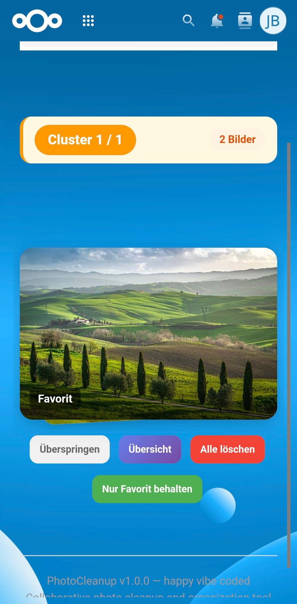
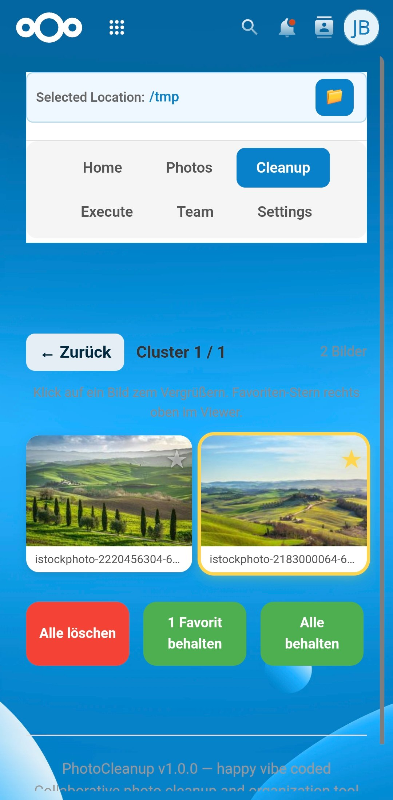
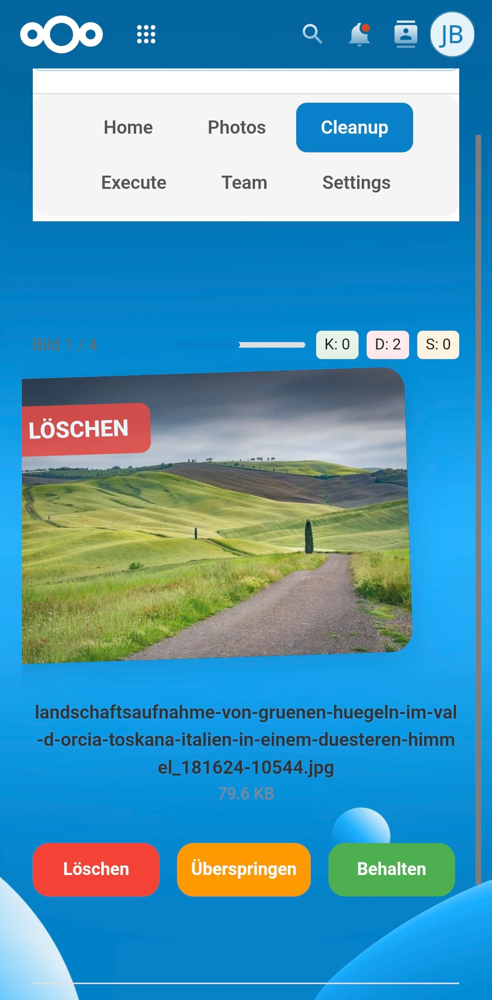
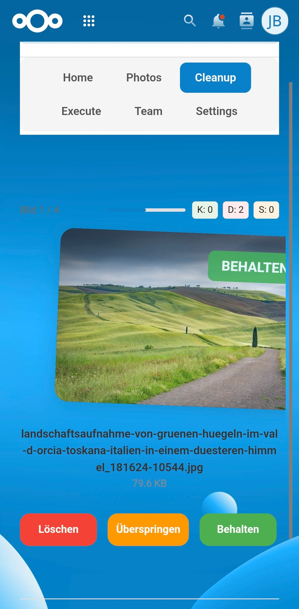
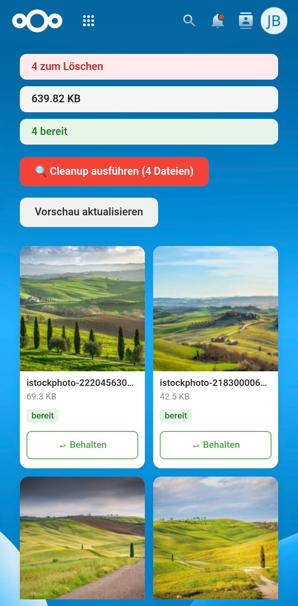

# PhotoCleanup — Collaborative Photo Management for Nextcloud

A Nextcloud app for collaborative photo review, voting, and cleanup.
Teams can collectively decide which photos to keep and which to delete.

> 🤖 **Exclusively vibe coded** — built entirely through AI-assisted development.

## Features

- 📸 Browse all photos in your Nextcloud folders
- 🗳️ Vote to **keep** or **delete** photos
- 👥 Collaborative consensus tracking
- 📦 **Quarantine** system — deleted photos are moved to a quarantine folder first
- 🔍 **Duplicate & Similar Detection** using perceptual hashing (pHash)
- 📊 Dashboard with voting statistics and consensus overview
- 📱 **PWA** support — install on mobile and work offline
- ⚙️ Configurable voting thresholds (±5 steps)
- 🗑️ **Forced delete** — admin can bypass consensus for immediate cleanup

## Requirements

- Nextcloud **28**–**34**
- PHP **8.1**–**8.4**
- PHP extensions: `gd`, `exif`, `mbstring`, `pdo_mysql`
- Node.js ≥ 18 and npm ≥ 9 for building the frontend

## Installation

### From GitHub

```bash
cd /var/www/nextcloud/apps/
git clone https://github.com/37-b-j/collaborativephotocleanup.git
cd collaborativephotocleanup
composer install --no-dev
cd js && npm install && npm run build && cd ..
sudo -u www-data php /var/www/nextcloud/occ app:enable collaborativephotocleanup
```

### WebP Support

PhotoCleanup supports WebP images. Nextcloud does not enable the WebP preview provider by default:

```bash
sudo -u www-data php occ config:system:set enabledPreviewProviders 0 --value="OC\Preview\WEBP" --type=string
```


## Screenshots

<p align="center">
  &nbsp;&nbsp;
  
</p>

<p align="center">
  &nbsp;&nbsp;
  &nbsp;&nbsp;
  
</p>

## License

AGPL-3.0-or-later
